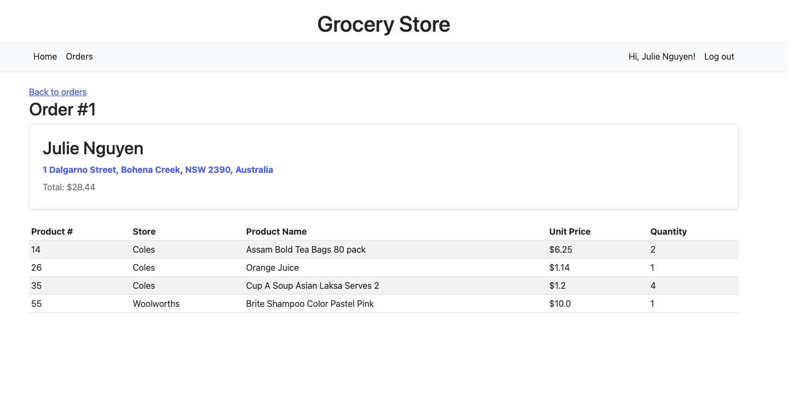

# Grocery-Store

A website that allows user to buy stuff and users who are admin role to manage and check buyer orders.

## A link (URL) to your deployed website

https://thawing-dusk-52692.herokuapp.com/

## A link to your GitHub repository

https://github.com/juliexxvi/Grocery-Store

## Tech stack

- Application:
  - Backend: Python - Flask
  - Frontend: HTML, CSS, JavaScript, Bootstrap
- Database: PostgreSQL
- Deployment server: Heroku
- Version Control:
  - Git
  - Github

## Sitemap - TBA

## Database


## Features

### Sign up

- Require that a user input email address, user's name, reference code and password. The program won't let the user to sign up if their email address already exists
- In order to sign up as an admin, please use the following reference code `123789456`
  

- Once the user finished the `sign up`, they will be able to `login`
  

### Homepage

- `Homepage` allows a user add stuff to their own cart. They can decide quantity for items they would like to purchase
  

### Add to cart

- After the user adds their desired items to their cart, there will have a cart pops up with the total quantity of items added.
  

### Cart

- `Cart` will show all items the user wanted to buy with the price per item, quantity and total amount the user will have to pay.
- In order to confirm the order, the user will have to enter their shipping address and user's name.
  

### Orders

- `Orders` allows admin users to view all successful orders and details of each order
- Admin user won't be able to make an order so when they nevigate to `homepage`, there will have no add to cart button.
  
  

## Todo

- Set up reference code for customers so they can login and see their order details, manage their account
- Add an external JSON API that can allow users to convert AUD to other currencies
- Add contact details
- Add functions to let users buy stuff selling at multiple stores at once.

## How to run it on your local machine

- Clone this repository to your local
- Assuming that you have [Python 3](https://www.python.org/downloads) installed
- Create your virtual env by running:

```
python3 -m venv venv
```

- Activate our virtual environment:

```
source venv/bin/activate
```

- Install our requirements:

```
pip3 install -r requirements.txt
```

> _When everything is done installing you will see a new `venv` folder that was created._

- Open a terminal at the project directory and run the command

```
python3 app.py
```

- Open your browser and go to the URL provided, the web app is ready to use now
- Once you have finished working on the project, you can deactivate the virtual environment:

```
deactivate
```
